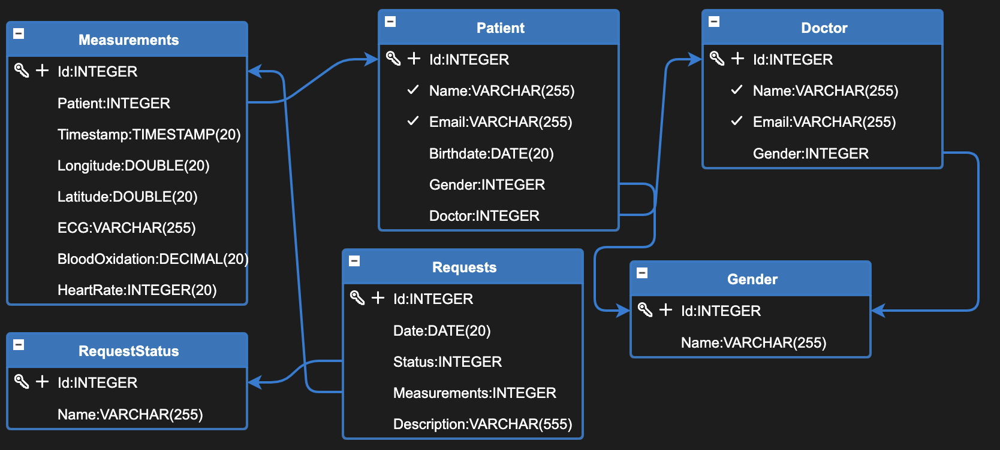

# Vitalis
Vitalis is an embedded device with a cloud-powered health monitoring platform designed to provide real-time health insights from home medical sensors to healthcare professionals. It helps individuals track vital signs such as ECG, heart rate, and blood oxygen levels.

## Access the App
### 👉 https://app.vitalis.nesechete.com/

## 🩺 How It Works
- Modular ECG Device: Our innovative ECG device can be used as a portable continuous 24/7 ECG sensor, detecting events such as heart issues during episodes like fainting. It can also be used as a home diagnostic tool, providing real-time monitoring of heart health in various scenarios.

- Multiple Vital Measurements: In addition to ECG, our device also tracks BPM (beats per minute), SpO2 (blood oxygen saturation), and integrates GPS for location tracking, giving a comprehensive overview of the user's health.

- Web App Integration: The web app visualizes sensor data. For elderly patients, the data can be displayed on a map to help doctors and relatives monitor their condition remotely. The app ensures the data is accessible and easy to interpret.

- Real-Time Feedback: Every patient is linked to a doctor, and the system provides AI-driven suggestions based on ECG analysis for early predictions of potential health issues. This helps healthcare professionals intervene quickly when necessary.

## 🔐 User Roles
#### User (Patient):

View personal vital statistics.

Pair and manage sensors.

Receive feedback from doctors.

#### Doctor:

Access assigned patient dashboards.

Review real-time and historical vitals.

Get real-time AI suggestions for diagnosifying

## 🛠️ Tech Stack
Backend: Eclipse Dirigible (API, dashboard)

Frontend: Integrated into Dirigible’s Web UI & dashboard

Keycloak: Auth, Roles, Token-based access

Deployment: Kubernetes (monitored via K9s)

Embedded: ESP32, SIM800L, AD8232, MAX30100

### Schematic:

### DB:

## Key Features
Modular ECG Device: Our innovative ECG device can be used as a continuous 24/7 ECG sensor, detecting events such as heart issues during episodes like fainting. It can also be used as a home diagnostic tool. This modularity allows for versatile use in various scenarios.

Multiple Vital Measurements: In addition to ECG, our device also tracks BPM (beats per minute), SpO2 (blood oxygen saturation), and integrates GPS for location tracking.

Web App Integration: The web app visualizes sensor data. For elderly patients, it can display their data on a map to help caregivers monitor their condition remotely.

Real-Time Feedback: Every patient is linked to a doctor, and the system provides AI-driven suggestions based on ECG analysis for early predictions of potential health issues.

## 📄 License
Vitalis is released under the MIT License. See the LICENSE file for full details.

## 🩺 Disclaimer
Vitalis is not a certified medical device. It is currently in active development and should only be used for testing, research, and demonstration purposes until certified by relevant regulatory bodies.